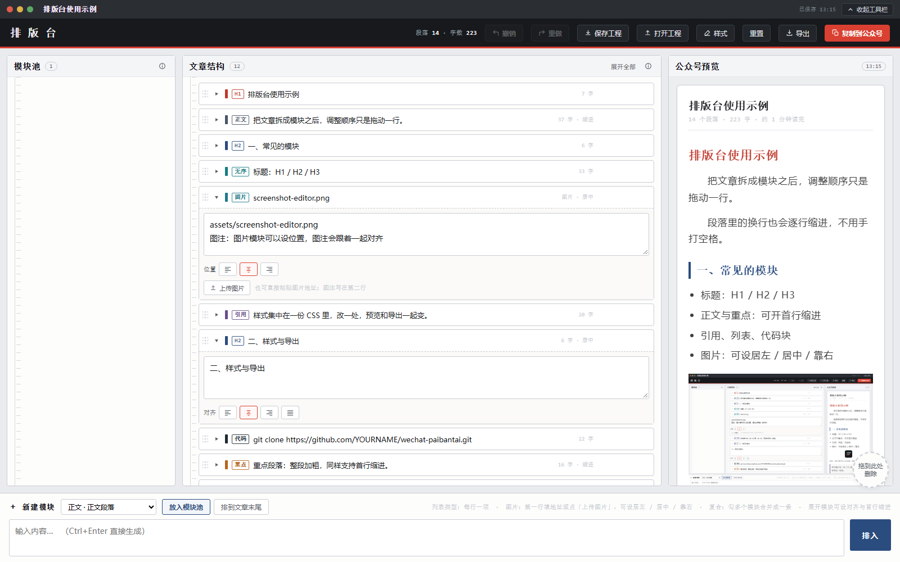

# 公众号排版台

> 把一篇文章拆成「模块」来排版：拖拽排序、对齐与首行缩进、样式一处改全篇生效，最后带样式复制进公众号编辑器。


**在线体验**：`https://YOURNAME.github.io/wechat-paibantai/`（把 `YOURNAME` 换成你的 GitHub 用户名；仓库开启 Pages 后即可访问）



## 它解决什么问题

在公众号编辑器里改排版是体力活：调一次字号要一段段刷，缩进只能手打空格，样式散落在每一个段落里，下次改主题又得重来一遍。

排版台的思路是**先有结构，再谈样式**：

- 内容按「模块」拆开（标题 / 正文 / 引用 / 列表 / 代码 / 图片…），拖拽排序，改顺序不用剪切粘贴。
- 段内格式（对齐、首行缩进）挂在模块上，不靠手打空格。
- 全篇样式集中在一份 CSS 里，改一处，预览和导出一起变。
- 导出时样式全部**内联**写进标签，粘贴到公众号不依赖外部样式表。

## 特性

- **三栏布局**：左边模块池（备用素材）、中间文章结构（可拖拽的树）、右边公众号预览（就是导出结果，所见即所得）。
- **13 种版式**：`H1` `H2` `H3` `正文` `重点` `引用` `无序` `有序` `代码` `分割` `图片` `组合` `复合`，任意模块都能一键换版式。
- **组合 / 复合**：把模块拖进「组合」收纳并加外框；「复合」折叠收纳但不加外框，专门用来缩短长列表。支持多层嵌套。
- **对齐与缩进**：左 / 居中 / 右 / 两端对齐；正文与重点段落可开首行缩进，**多行内容每一行都会缩进**（不是只有第一行）。
- **图片模块**：填图片地址或上传（需自建后端，见下），可设居左 / 居中 / 靠右，第二行起自动成为灰色图注并跟随同一对齐。
- **样式替换**：内置样式面板，直接改 `.wrap` `.h1` `.p` `.img` `.box` 等选择器的声明，预览与导出同步生效，并随工程一起保存。
- **多种导出**：带样式复制到公众号（富文本）、复制纯文本、复制 HTML、下载 `.html`、导出 Word（`.doc`）、导出 PDF（走系统打印）。
- **Markdown 导入**：点「导入 MD」选 `.md` / `.txt` 文件（或直接拖进窗口），自动按语法拆成模块――`#` 标题、`>` 引用、列表、围栏代码、分割线、`` 图片、整段加粗变「重点」，行内标记自动去标记。
- **工程管理**：保存 / 打开 `.ptai.json` 工程文件，也可以把 json 直接拖进页面打开；编辑过程自动存在浏览器本地。
- **撤销重做**：80 步历史，删错、拖歪都能回退。
- **零依赖**：单个 HTML 文件，无框架、无构建步骤、不联网也能用。

## 快速开始

**方式一：直接下载用**

下载仓库里的 `index.html`，双击用浏览器打开即可（推荐 Chrome / Edge）。

**方式二：克隆下来用**

```bash
git clone https://github.com/YOURNAME/wechat-paibantai.git
cd wechat-paibantai
# 直接双击 index.html，或起个本地服务（复制到剪贴板更稳）
python -m http.server 8080
# 打开 http://localhost:8080/
```

**方式三：在线用**

仓库开启 GitHub Pages（Settings → Pages → Source 选 `main` 分支根目录）后，访问 `https://YOURNAME.github.io/wechat-paibantai/`。

## 三分钟上手

1. 底部「＋ 新建模块」选版式，写好内容，点「排入」→ 丢进**模块池**或直接**排到文章末尾**。
2. 在中间栏拖动模块调整顺序；拖进虚线框可收纳进「组合」。
3. 点模块左侧三角展开，正文类模块能设**对齐**和**首行缩进**，图片模块能设**位置**。
4. 右上角「样式」改全篇样式，「复制到公众号」一键带走，或「导出」拿 HTML / Word / PDF。

## 快捷键

| 快捷键 | 作用 |
| --- | --- |
| `Ctrl + Z` / `Ctrl + Shift + Z`（或 `Ctrl + Y`） | 撤销 / 重做 |
| `Ctrl + S` | 保存工程（`.ptai.json`） |
| `Ctrl + O` | 打开工程 |
| `Ctrl + Shift + C` | 带样式复制到公众号 |
| `Ctrl + P` | 导出 PDF（打开打印窗口） |
| `Ctrl + Enter` | 在底部输入框里直接排入 |
| `Ctrl + 点击模块行` | 多选（用于合并成复合模块） |
| `Shift + 点击模块行 / 选择按钮` | 从已选锚点整段选到点击处（同层级） |
| `Enter`（模块行聚焦时） | 展开 / 收起 |
| `Delete` | 删除模块 |
| `Ctrl + D` | 复制一份 |
| `Alt + ↑ / ↓` | 上移 / 下移 |
| `Alt + →` | 收进上方最近的组合 |
| `Alt + ←` | 从组合里移出 |
| `Esc` | 取消多选 / 关闭弹窗 |

## 版式一览

| 模块 | 导出标签 | 说明 |
| --- | --- | --- |
| H1 / H2 / H3 | `<h1>` `<h2>` `<h3>` | 一 / 二 / 三级标题；H2 默认带左侧色条，改居中或右对齐时自动去掉 |
| 正文 | `<p>` | 普通段落，支持首行缩进 |
| 重点 | `<p>` | 整段加粗 |
| 引用 | `<blockquote>` | 引文、备注 |
| 无序 / 有序 | `<ul>` `<ol>` | 每行一项，自动编号 |
| 代码 | `<pre><code>` | 等宽字体，贴代码 |
| 分割 | `<hr>` | 一条水平分隔线 |
| 图片 | `<p>` | 第一行地址，第二行起图注，可设居左 / 居中 / 靠右 |
| 组合 | `<section>` | 带虚线外框的容器，导出保留外框 |
| 复合 | ― | 只输出内部模块，不加外框 |

## 自定义样式

「样式」面板里只认 `.选择器 { 声明 }` 这一种写法，注释随意。可用选择器：

```
.wrap   全篇容器（字号 / 行高 / 字色 / 字体）
.h1 .h2 .h3   标题
.p      正文段落
.strong 重点段落
.quote  引用块
.ul .ol .li   列表
.pre .code    代码块
.hr     分割线
.imgbox 图片外框（text-align 由「位置」按钮写入）
.img    图片本体
.cap    图注
.box    「组合」模块的外框
```

例：把主色换成墨绿、正文字号调大一点：

```css
.h2 { color:#2F5D50; border-left:4px solid #2F5D50; }
.p  { font-size:17px; line-height:1.9; }
```

细节见 [docs/样式定制.md](docs/样式定制.md)。

## 图片上传（可选）

图片模块的「上传图片」按钮会 `POST` 一个 `multipart/form-data` 到同目录的 `api.ashx?action=uploadfile`（字段名 `file`），期望返回：

```json
{ "success": true, "url": "/uploads/图片名.png" }
```

本仓库只包含前端，**不含后端**。你可以：

- 直接在第一行粘贴图片地址（图床、自建站点都行）――最省事；
- 或自己写一个上传接口，按上面的约定返回 `url` 即可。

## 目录结构

```
wechat-paibantai/
├─ index.html           排版台本体（单文件应用，Pages 入口）
├─ assets/              图标与截图
├─ docs/                使用说明 / 样式定制 / 导出与粘贴 / 开发说明
├─ examples/            示例工程（.ptai.json）与导出效果
└─ .github/             issue 与 PR 模板
```

## 已知限制

- **复制富文本**依赖浏览器剪贴板 API，`https` 或 `localhost` 下最稳；用 `file://` 直接打开时会退回到 `execCommand` 兜底方案，个别浏览器可能失败――这种情况请用「导出 → 复制 HTML」。
- **图片上传**需要自建后端（见上）；在线演示版没有后端，请手动填地址。
- 导出的内容样式全部内联，但公众号编辑器粘贴后可能做二次处理（例如补自己的边距）。若发现样式被改，请以公众号里的最终效果为准微调，或改用「复制 HTML」贴到支持 HTML 的地方。
- 工程数据默认存在**浏览器 localStorage** 里，换浏览器或清缓存会丢。重要内容请用 `Ctrl + S` 存成 `.ptai.json`。
- 单文件应用，所有代码都在 `index.html` 里；文件较大属于刻意取舍（方便分发与离线使用）。

## 参与贡献

欢迎提 issue 和 PR，尤其是：新的模块版式、样式预设、导出兼容性问题。请先看 [CONTRIBUTING.md](CONTRIBUTING.md) 与 [docs/开发说明.md](docs/开发说明.md)。

## 更新记录

见 [CHANGELOG.md](CHANGELOG.md)。

## License

[MIT](LICENSE) ? 2026 HiBO
